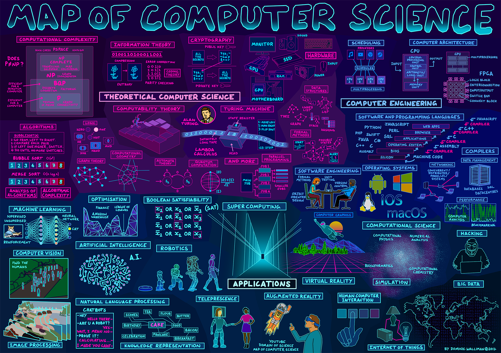

# What is Computer Science?

Computer Science is the study of computers and computational systems. Unlike electrical and computer engineers, computer scientists deal mostly with software and software systems; this includes their theory, design, development, and application.

Principal areas of study within Computer Science include artificial intelligence, computer systems and networks, security, database systems, human computer interaction, vision and graphics, numerical analysis, programming languages, software engineering, bioinformatics and theory of computing.

Although knowing how to program is essential to the study of computer science, it is only one element of the field. Computer scientists design and analyze algorithms to solve programs and study the performance of computer hardware and software. The problems that computer scientists encounter range from the abstract-- determining what problems can be solved with computers and the complexity of the algorithms that solve them – to the tangible – designing applications that perform well on handheld devices, that are easy to use, and that uphold security measures.

> Homework: list real-life 5 examples of Computer Systems that you use daily.

## Relationship between software and hardware

Computer consists of two main parts: software and hardware.

[Hardware](./1-Computer-Structure.md) is the physical part of the computer: case, mouse, keyboard, monitor etc.

[Software](./2-Computer-Software.md) is instructions that are given to a hardware to execute actions.